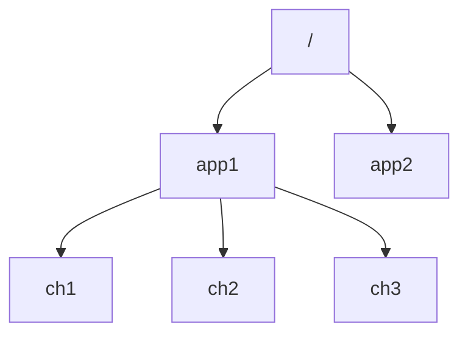
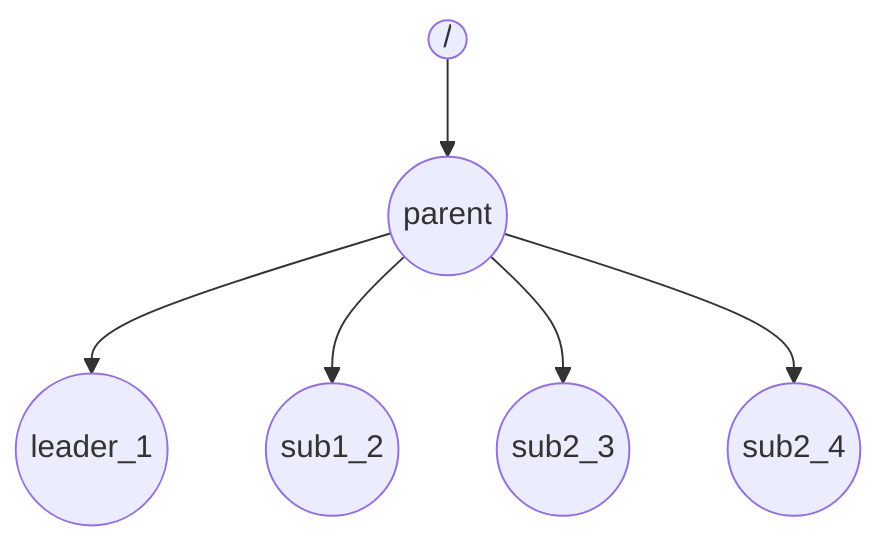

# Terminologies:
## Node 
  Process running on a dedicated machine
  
## Cluster 
 Collection of computers/nodes connected to each other
 They are typically running same set of tasks
 
## Zookeeper
 1. High speed co-ordination service for distributed system
 2. Provides high avaialabilty and reliabilty
 3. Redendency to allow failures

Zookeeper maintains set of Znodes to store data. Structure of the Znode is similar to a filesystem. Its a hybrid b/w file and directory.

1. It can store data
2. It can have children

### Znodes

2 types of Znodes
- Persistent - persists b/w sessions
- Ephemeral - deleted when session ends

Zookeeper maintains a global order according to order of addition of every Znode. 

##### Zookeeper Threading:

Zookeeper application is running on the main thread. For every Zookeeper object that is created, two other threads are created

1. Event Thread - Connection, Disconnection of Nodes and also Watchers and Triggers
2. IO Thread - Handles all sys level info like network, req, res, session management.

##### Watchers and Triggers
Watcher allows us to get notification when changes happen , on methods like 
- a. getChildren() 
- b. delete()

This is a simple diagram showing ZooKeeper cluster with Watchers 

### Simple Leader Election Algorithm.

Step 1: A cluster is formed with a parent node to which all other Znodes coonect

Step 2. Every node connecting to the parent creates a Znode and states its intention to become the leader. Since Zookeeper maintains the order, each node connected is 
        assigned a number.

Step3. Once the Znode has joined it asks the parent for all the nodes in the cluster.

Step 4. If the Znode is the smallest among the list its the leader else it is not a leader

The problem is with algorithm is once the leader dies there is no one to succeed. This can be overcome using watchers.

Based on this concept, Zookeeper cluster has a leader and all the nodes can watch the leader and subscribe to NodeDeleted event, if 
the leader dies all the nodes will get notified this will result in lot of messages and what is called the  HERD EFFECT as large number of nodes are waiting for a event and when it happens they all are notified
and they all try to become the next leader. However in this case only one node can only succeed(by default the one which joined the cluster after the leader)

The state of the cluster can have the following events and get flodded.

#### How we elect a better leader
- Every node connecting to the parent creates a Znode and calls getChildren() on parent
- It only watches the Znode which comes before it.

- Now when leader and notification happens only one Znode (the successor) is notified instead of all the nodes
- This node can call getChildren to make sure its the leader
